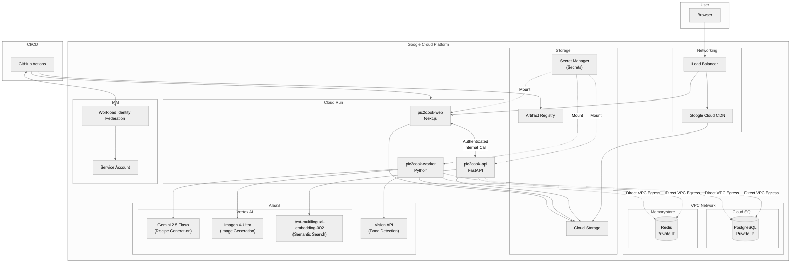
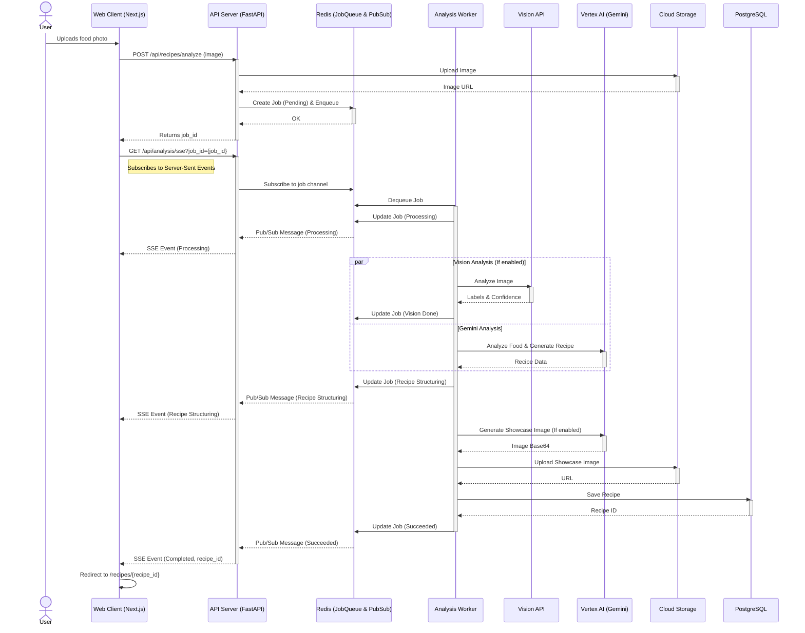

# Pic2Cook

  

## Architecture Diagram

## Analysis Request Flow

## Project Dependencies (Auto-generated)

### Backend (Python/FastAPI)
| Library | Constraint |
| :--- | :--- |
| fastapi | >=0.121.3 |
| uvicorn[standard | latest |

### Frontend (Node.js/Next.js)
| Package | Version |
| :--- | :--- |
| @google-cloud/opentelemetry-cloud-trace-exporter | ^3.0.0 |
| @microsoft/clarity | ^1.0.2 |
| @opentelemetry/api | ^1.9.0 |
| @opentelemetry/instrumentation-fetch | ^0.208.0 |
| @opentelemetry/instrumentation-http | ^0.208.0 |
| @opentelemetry/resources | ^2.2.0 |
| @opentelemetry/sdk-node | ^0.208.0 |
| @opentelemetry/sdk-trace-base | ^2.2.0 |
| @opentelemetry/semantic-conventions | ^1.38.0 |
| @radix-ui/react-accordion | ^1.2.12 |
| @radix-ui/react-alert-dialog | ^1.1.15 |
| @radix-ui/react-avatar | ^1.1.11 |
| @radix-ui/react-checkbox | ^1.3.3 |
| @radix-ui/react-collapsible | ^1.1.12 |
| @radix-ui/react-dialog | ^1.1.15 |
| @radix-ui/react-dropdown-menu | ^2.1.16 |
| @radix-ui/react-popover | ^1.1.15 |
| @radix-ui/react-progress | ^1.1.8 |
| @radix-ui/react-scroll-area | ^1.2.10 |
| @radix-ui/react-select | ^2.2.6 |
| @radix-ui/react-separator | ^1.1.8 |
| @radix-ui/react-slider | ^1.3.6 |
| @radix-ui/react-slot | ^1.2.4 |
| @radix-ui/react-tooltip | ^1.2.8 |
| @serwist/turbopack | ^10.0.0-preview.14 |
| @t3-oss/env-nextjs | ^0.13.8 |
| @tabler/icons-react | ^3.35.0 |
| @tanstack/react-devtools | ^0.8.4 |
| @tanstack/react-form-devtools | ^0.2.5 |
| @tanstack/react-form | ^1.27.2 |
| @tanstack/react-query-devtools | ^5.91.1 |
| @tanstack/react-query | ^5.90.12 |
| ahooks | ^3.9.6 |
| axios | ^1.13.2 |
| better-auth | ^1.4.6 |
| canvas-confetti | ^1.9.4 |
| class-variance-authority | ^0.7.1 |
| clsx | ^2.1.1 |
| es-toolkit | ^1.42.0 |
| import-in-the-middle | ^2.0.0 |
| jotai-devtools | ^0.13.0 |
| jotai-location | ^0.6.2 |
| jotai | ^2.16.0 |
| luxon | ^3.7.2 |
| motion | ^12.23.25 |
| next-intl | ^4.5.8 |
| next | ^16.0.8 |
| react-dom | ^19.2.1 |
| react-icons | ^5.5.0 |
| react-markdown | ^10.1.0 |
| react | ^19.2.1 |
| remark-gfm | ^4.0.1 |
| require-in-the-middle | ^8.0.1 |
| serwist | ^10.0.0-preview.14 |
| sonner | ^2.0.7 |
| tailwind-merge | ^3.4.0 |
| zod | ^4.1.13 |
