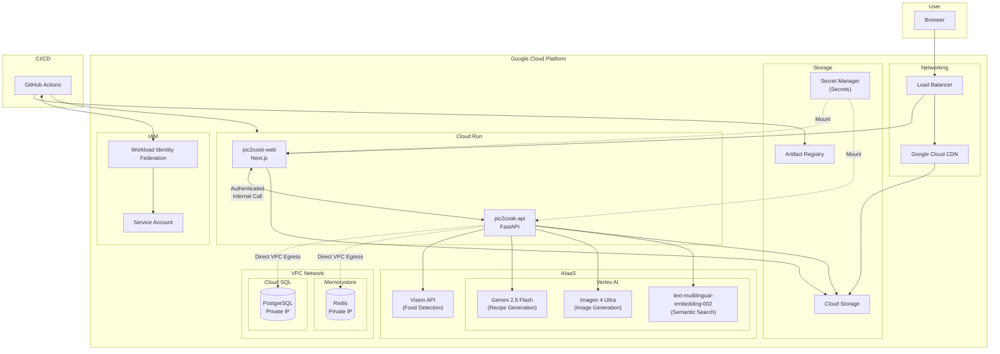
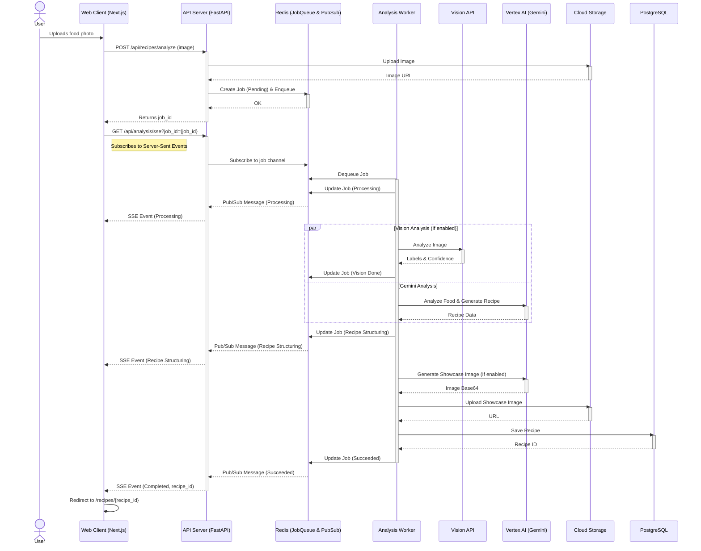

# Pic2Cook

  

## Architecture Diagram

```mermaid
flowchart TB
    subgraph Users["User"]
        Browser["Browser"]
    end

    subgraph GCP["Google Cloud Platform"]

        subgraph Network["Networking"]
            CloudCDN["Google Cloud CDN"]
            LB["Load Balancer"]
        end

        subgraph CloudRun["Cloud Run"]
            WebService["pic2cook-web<br/>Next.js"]
            APIService["pic2cook-api<br/>FastAPI"]
        end

        subgraph VPCNetwork["VPC Network"]
            subgraph CloudSQL["Cloud SQL"]
                PostgreSQL[("PostgreSQL<br/>Private IP")]
            end

            subgraph Memorystore["Memorystore"]
                Redis[("Redis<br/>Private IP")]
            end
        end

        subgraph Storage["Storage"]
            GCS["Cloud Storage"]
            ArtifactRegistry["Artifact Registry"]
            SecretManager["Secret Manager<br/>(Secrets)"]
        end

        subgraph AI["AIaaS"]
            subgraph VertexAI["Vertex AI"]
                Gemini["Gemini 2.5 Flash<br/>(Recipe Generation)"]
                Imagen["Imagen 4 Ultra<br/>(Image Generation)"]
                Embeddings["text-multilingual-embedding-002<br/>(Semantic Search)"]
            end
            VisionAPI["Vision API<br/>(Food Detection)"]
        end

        subgraph IAM["IAM"]
            WorkloadIdentity["Workload Identity Federation"]
            ServiceAccount["Service Account"]
        end
    end

    subgraph CICD["CI/CD"]
        GitHub["GitHub Actions"]
    end

    %% Flow
    Browser --> LB
    LB --> WebService
    LB --> CloudCDN
    CloudCDN --> GCS

    %% Service to Service (Internal)
    WebService <-->|Authenticated<br/>Internal Call| APIService

    %% Backend logic
    APIService -.->|Direct VPC Egress| PostgreSQL
    APIService -.->|Direct VPC Egress| Redis

    APIService --> VisionAPI
    APIService --> Gemini
    APIService --> Imagen
    APIService --> Embeddings

    %% Storage & Secrets
    APIService --> GCS
    WebService --> GCS
    SecretManager -.->|Mount| WebService
    SecretManager -.->|Mount| APIService

    %% CI/CD
    GitHub --> ArtifactRegistry
    GitHub --> CloudRun
    GitHub <--> WorkloadIdentity
    WorkloadIdentity --> ServiceAccount
```

## Analysis Request Flow

```mermaid
sequenceDiagram
    actor User
    participant Web as Web Client (Next.js)
    participant API as API Server (FastAPI)
    participant Redis as Redis (JobQueue & PubSub)
    participant Worker as Analysis Worker
    participant Vision as Vision API
    participant Gemini as Vertex AI (Gemini)
    participant GCS as Cloud Storage
    participant DB as PostgreSQL

    User->>Web: Uploads food photo
    Web->>API: POST /api/recipes/analyze (image)
    activate API
    
    API->>GCS: Upload Image
    activate GCS
    GCS-->>API: Image URL
    deactivate GCS

    API->>Redis: Create Job (Pending) & Enqueue
    activate Redis
    Redis-->>API: OK
    deactivate Redis

    API-->>Web: Returns job_id
    deactivate API

    Web->>API: GET /api/analysis/sse?job_id={job_id}
    activate API
    Note right of Web: Subscribes to Server-Sent Events

    API->>Redis: Subscribe to job channel
    
    Worker->>Redis: Dequeue Job
    activate Worker
    
    Worker->>Redis: Update Job (Processing)
    Redis-->>API: Pub/Sub Message (Processing)
    API-->>Web: SSE Event (Processing)

    par Vision Analysis (If enabled)
            Worker->>Vision: Analyze Image
            activate Vision
            Vision-->>Worker: Labels & Confidence
            deactivate Vision
            Worker->>Redis: Update Job (Vision Done)
    and Gemini Analysis
            Worker->>Gemini: Analyze Food & Generate Recipe
            activate Gemini
            Gemini-->>Worker: Recipe Data
            deactivate Gemini
    end

    Worker->>Redis: Update Job (Recipe Structuring)
    Redis-->>API: Pub/Sub Message (Recipe Structuring)
    API-->>Web: SSE Event (Recipe Structuring)

    Worker->>Gemini: Generate Showcase Image (If enabled)
    activate Gemini
    Gemini-->>Worker: Image Base64
    deactivate Gemini
    
    Worker->>GCS: Upload Showcase Image
    activate GCS
    GCS-->>Worker: URL
    deactivate GCS
    
    Worker->>DB: Save Recipe
    activate DB
    DB-->>Worker: Recipe ID
    deactivate DB

    Worker->>Redis: Update Job (Succeeded)
    deactivate Worker

    Redis-->>API: Pub/Sub Message (Succeeded)
    API-->>Web: SSE Event (Completed, recipe_id)
    deactivate API

    Web->>Web: Redirect to /recipes/{recipe_id}
```