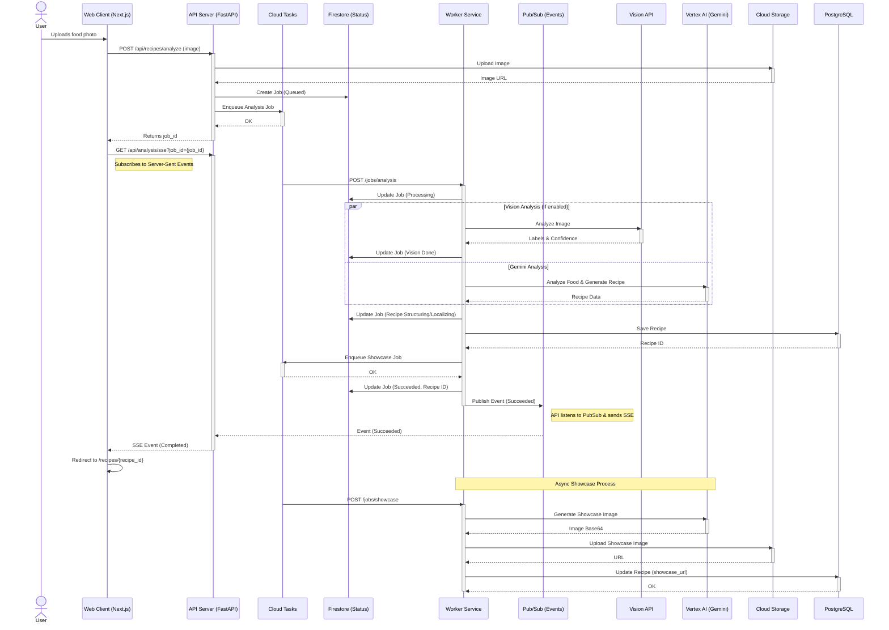

# Pic2Cook

  

## Deployment

This project uses Google Cloud Platform (Cloud Run, Cloud SQL, Cloud Tasks).

For detailed instructions on deploying the **Worker Service**, please refer to [Worker Deployment Guide](docs/worker_deployment.md).

### Basic Deployment Steps

## Architecture Diagram

## Analysis Request Flow

## Project Dependencies

### Backend (Python/FastAPI)
| Library | Constraint |
| :--- | :--- |
| alembic | >=1.14.0 |
| async-lru | >=2.0.5 |
| asyncpg | >=0.30.0 |
| authlib | >=1.4.0 |
| faker | >=38.2.0 |
| fastapi | >=0.121.3 |
| google-auth | >=2.36.0 |
| google-cloud-aiplatform | >=1.73.0 |
| google-cloud-firestore | >=2.14.0 |
| google-cloud-pubsub | >=2.19.0 |
| google-cloud-storage | >=2.19.0 |
| google-cloud-tasks | >=2.20.0 |
| google-cloud-vision | >=3.9.0 |
| google-generativeai | >=0.8.3 |
| httpx | >=0.28.0 |
| json-repair | >=0.54.3 |
| langfuse | >=3.11.1 |
| minio | >=7.2.0 |
| openai | >=1.55.0 |
| passlib[bcrypt] | >=1.7.4 |
| pgvector | >=0.3.0 |
| pillow | >=11.0.0 |
| psycopg2-binary | >=2.9.11 |
| psycopg[binary] | >=3.3.2 |
| pydantic-settings | >=2.7.0 |
| pydantic[email] | >=2.10.0 |
| python-jose[cryptography] | >=3.3.0 |
| python-multipart | >=0.0.20 |
| pywebpush | >=2.1.2 |
| scalar-fastapi | >=1.4.4 |
| slowapi | >=0.1.9 |
| sqlalchemy[asyncio] | >=2.0.0 |
| sse-starlette | >=3.0.3 |
| uvicorn[standard] | >=0.38.0 |

### Frontend (Node.js/Next.js)
| Package | Version |
| :--- | :--- |
| @google-cloud/opentelemetry-cloud-trace-exporter | ^3.0.0 |
| @microsoft/clarity | ^1.0.2 |
| @monaco-editor/react | ^4.7.0 |
| @opentelemetry/api | ^1.9.0 |
| @opentelemetry/instrumentation-fetch | ^0.208.0 |
| @opentelemetry/instrumentation-http | ^0.208.0 |
| @opentelemetry/resources | ^2.2.0 |
| @opentelemetry/sdk-node | ^0.208.0 |
| @opentelemetry/sdk-trace-base | ^2.2.0 |
| @opentelemetry/semantic-conventions | ^1.38.0 |
| @radix-ui/react-accordion | ^1.2.12 |
| @radix-ui/react-alert-dialog | ^1.1.15 |
| @radix-ui/react-avatar | ^1.1.11 |
| @radix-ui/react-checkbox | ^1.3.3 |
| @radix-ui/react-collapsible | ^1.1.12 |
| @radix-ui/react-dialog | ^1.1.15 |
| @radix-ui/react-dropdown-menu | ^2.1.16 |
| @radix-ui/react-label | ^2.1.8 |
| @radix-ui/react-popover | ^1.1.15 |
| @radix-ui/react-progress | ^1.1.8 |
| @radix-ui/react-scroll-area | ^1.2.10 |
| @radix-ui/react-select | ^2.2.6 |
| @radix-ui/react-separator | ^1.1.8 |
| @radix-ui/react-slider | ^1.3.6 |
| @radix-ui/react-slot | ^1.2.4 |
| @radix-ui/react-switch | ^1.2.6 |
| @radix-ui/react-toggle-group | ^1.1.11 |
| @radix-ui/react-toggle | ^1.1.10 |
| @radix-ui/react-tooltip | ^1.2.8 |
| @react-spring/web | ^10.0.3 |
| @t3-oss/env-nextjs | ^0.13.10 |
| @tabler/icons-react | ^3.36.0 |
| @tanstack/react-devtools | ^0.8.6 |
| @tanstack/react-form-devtools | ^0.2.9 |
| @tanstack/react-form | ^1.27.6 |
| @tanstack/react-query-devtools | ^5.91.1 |
| @tanstack/react-query | ^5.90.12 |
| ahooks | ^3.9.6 |
| axios | ^1.13.2 |
| better-auth | ^1.4.9 |
| canvas-confetti | ^1.9.4 |
| class-variance-authority | ^0.7.1 |
| clsx | ^2.1.1 |
| cmdk | ^1.1.1 |
| driver.js | ^1.4.0 |
| embla-carousel-react | ^8.6.0 |
| es-toolkit | ^1.43.0 |
| feed | ^5.1.0 |
| heic-to | ^1.3.0 |
| import-in-the-middle | ^2.0.0 |
| jotai-devtools | ^0.13.0 |
| jotai-location | ^0.6.2 |
| jotai | ^2.16.1 |
| luxon | ^3.7.2 |
| motion | ^12.23.26 |
| next-intl | ^4.6.1 |
| next | ^16.1.1 |
| react-dom | ^19.2.3 |
| react-icons | ^5.5.0 |
| react | ^19.2.3 |
| require-in-the-middle | ^8.0.1 |
| sharp | ^0.34.5 |
| sonner | ^2.0.7 |
| tailwind-merge | ^3.4.0 |
| ua-parser-js | ^2.0.7 |
| vaul | ^1.1.2 |
| zod | ^4.2.1 |

### Mobile (Flutter)
| Package | Version |
| :--- | :--- |
| cached_network_image | ^3.4.1 |
| cupertino_icons | ^1.0.8 |
| dio | ^5.9.0 |
| firebase_core | ^4.3.0 |
| firebase_messaging | ^16.1.0 |
| flutter | Flutter SDK |
| flutter_facebook_auth | ^7.1.2 |
| flutter_local_notifications | ^19.5.0 |
| flutter_localizations | Flutter SDK |
| flutter_riverpod | ^3.1.0 |
| flutter_secure_storage | ^10.0.0 |
| forui | ^0.17.0 |
| freezed_annotation | ^3.1.0 |
| get_it | ^9.2.0 |
| go_router | ^17.0.1 |
| google_sign_in | ^7.2.0 |
| image_picker | ^1.2.1 |
| infinite_scroll_pagination | 5.1.1 |
| injectable | ^2.7.1 |
| intl | ^0.20.2 |
| jiffy | ^6.4.4 |
| json_annotation | ^4.9.0 |
| pretty_dio_logger | ^1.4.0 |
| retrofit | ^4.9.2 |
| riverpod | ^3.1.0 |
| riverpod_annotation | ^4.0.0 |
| share_plus | ^12.0.1 |
| video_player | ^2.10.1 |
